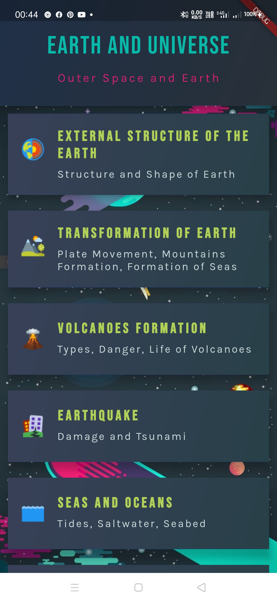
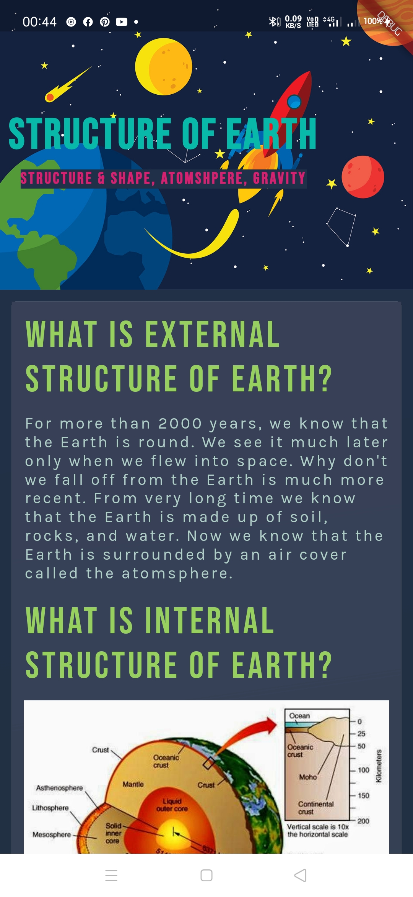
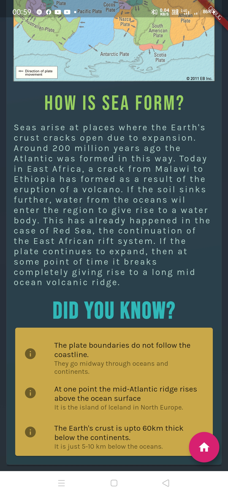

# Earth Encyolopedia App

An app to boost learning of scinece in young kids designed in Flutter. It available for iOS and Android

## Installation

You need to download the code and compile it.

## Contributing
Pull requests are welcome. For major changes, please open an issue first to discuss what you would like to change.

Please make sure to update tests as appropriate.

## License
[MIT](https://choosealicense.com/licenses/mit/)